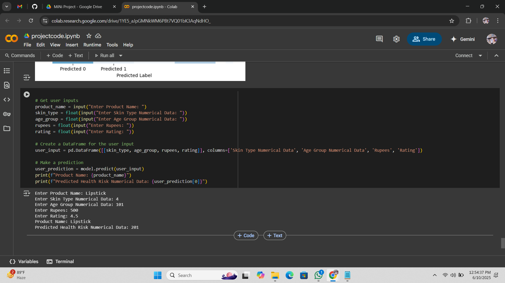

# 🧴 Cosmetics Health Risk Prediction 🧪

This project uses machine learning to predict **health risk scores** of cosmetic products based on numerical data such as skin type, age group, product cost, and user ratings.

---

## 📌 Brief Explanation

This is a binary classification problem where the model predicts a health risk category (e.g., safe or risky) for cosmetic products. The project utilizes **Logistic Regression** for prediction and includes data cleaning, EDA (exploratory data analysis), model training, evaluation, and prediction using user input.

---

## ✨ Features

- ✅ Data loading and preprocessing
- 📊 Boxplots and heatmaps for EDA
- 🤖 Logistic Regression model training
- 🧪 Model evaluation using accuracy, confusion matrix, and classification report
- 🔮 Prediction for new user input based on product details

---

## 🗂️ Project Structure

Cosmetics-Health-Risk-Prediction/
│
├── dataset_cosmetics.csv # Dataset used
├── cosmetics_health_risk.ipynb # Jupyter notebook with complete code
├── requirements.txt # Required libraries (auto-generated)
├── output_screenshot.png # Output example (e.g., confusion matrix or prediction)
└── README.md # Project documentation (this file)

---

## 📸 Output Screenshot

Below is a sample output showing the confusion matrix of predictions made by the Logistic Regression model:

---

## ⚙️ Technologies Used

- Python
- Pandas, NumPy
- Seaborn, Matplotlib
- Scikit-learn (Logistic Regression, metrics)
- Google Colab

---

## 🔮 Future Improvements

- Try more advanced classifiers (Random Forest, SVM, etc.)
- Include feature importance analysis
- Add web interface using Streamlit or Flask

---

## 📬 How to Use

1. Clone the repo
2. Run the notebook in Google Colab or Jupyter Notebook
3. Enter the required product details
4. Get health risk prediction instantly!

---
